# BigLinux TTS

<p align="center">
  
</p>

<p align="center">
  <strong>Select any text, press Alt+V, and hear it — native text-to-speech for the Linux desktop</strong>
</p>

<p align="center">
  <a href="https://www.gnu.org/licenses/gpl-3.0.html"></a>
  
  
  
  
  
  
  
  
</p>

---

## Table of Contents

- [About](#about)
- [Screenshots](#screenshots)
- [History](#history)
- [Features](#features)
- [TTS Engines](#tts-engines)
- [Architecture](#architecture)
- [Installation](#installation)
- [Usage](#usage)
- [Configuration](#configuration)
- [Internationalization](#internationalization)
- [Technical Details](#technical-details)
- [Testing](#testing)
- [Building from Source](#building-from-source)
- [License](#license)
- [Authors](#authors)

---

## About

**BigLinux TTS** is a native Linux desktop application that reads text aloud. Built with GTK4, libadwaita and a native Rust engine, it is the built-in text-to-speech tool of [BigLinux](https://www.biglinux.com.br/) — a Brazilian Linux distribution based on Manjaro/Arch Linux.

Select any text on screen, press **Alt+V**, and hear it read aloud. Press again to stop. No complicated setup: installing the package brings a ready Brazilian Portuguese voice.

### Use Cases

- **Accessibility** — screen reading for users with visual impairments or reading difficulties
- **Multitasking** — listen to articles, documents, and emails while doing other things
- **Language learning** — hear correct pronunciation in 100+ languages
- **Proofreading** — catch writing errors by listening to what was written
- **Productivity** — convert passive reading into active listening

### What Sets It Apart

1. **4 TTS engines** — RHVoice, espeak-ng (native FFI), Piper (native ONNX) and Kokoro neural voices
2. **Native Rust engine** — espeak-ng via direct FFI and Piper ONNX inference via `ort`; the GIL is released during synthesis, so the window never freezes
3. **Honest feedback** — the window shows the real state (loading the voice, speaking, stopped, error with the reason and how to fix it); nothing fails silently
4. **Reliable global shortcut** — registered through the desktop's own API and confirmed before the app says it works; conflicts are named
5. **Smart text processing** — expands abbreviations, normalizes numbers, pronounces special characters, strips HTML/Markdown
6. **Desktop integration** — system tray with playback controls, MPRIS media controls, notifications
7. **Modern UI** — GTK4 + libadwaita (GNOME HIG), adaptive down to 360 px wide, light/dark, RTL, reduced motion
8. **30 languages** — every string translated; Portuguese of Brazil and of Portugal kept separate
9. **Plain Arch packaging** — every dependency comes from the official Arch/Manjaro repositories

---

## Screenshots

| Ready to speak (dark) | Ready to speak (light) |
|---|---|
| 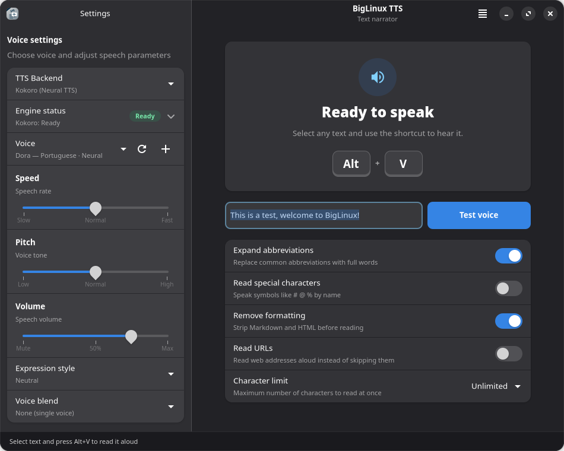 | 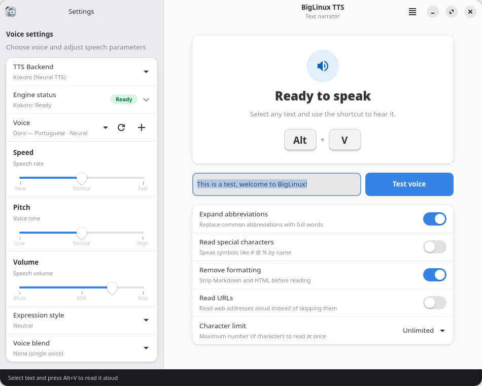 |

| Speaking | Error with a way out |
|---|---|
| 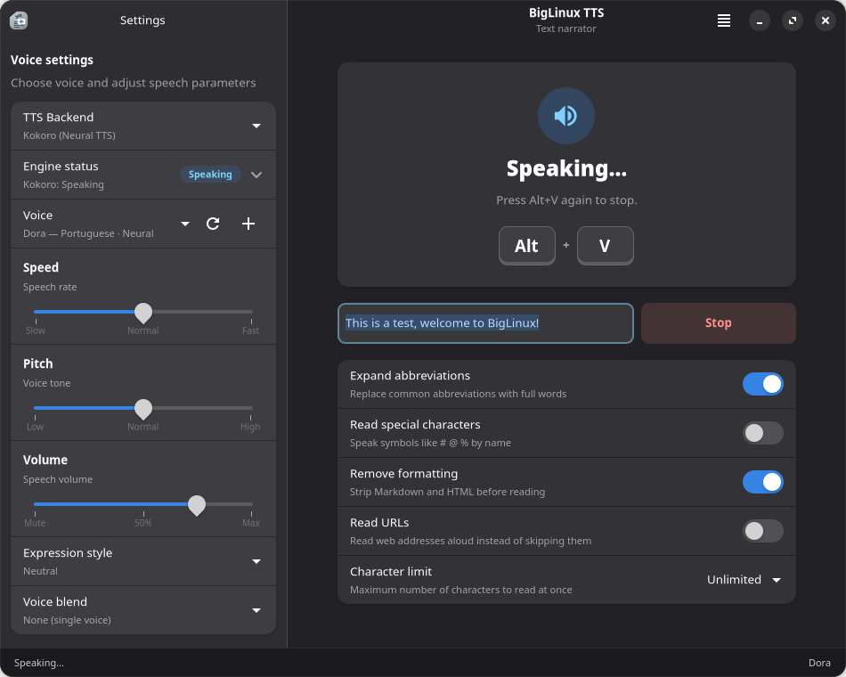 | 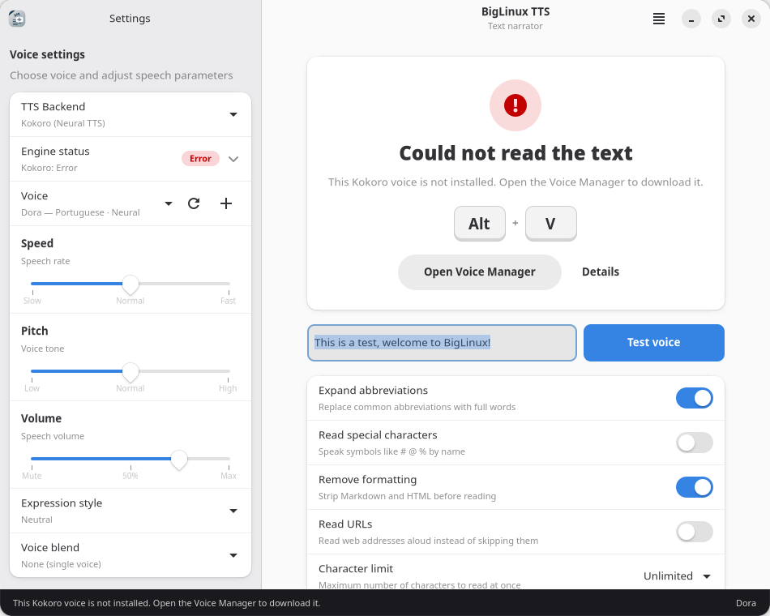 |

| Engine status | Voice Manager |
|---|---|
| 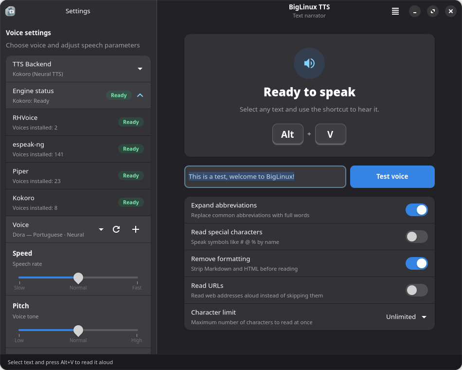 | 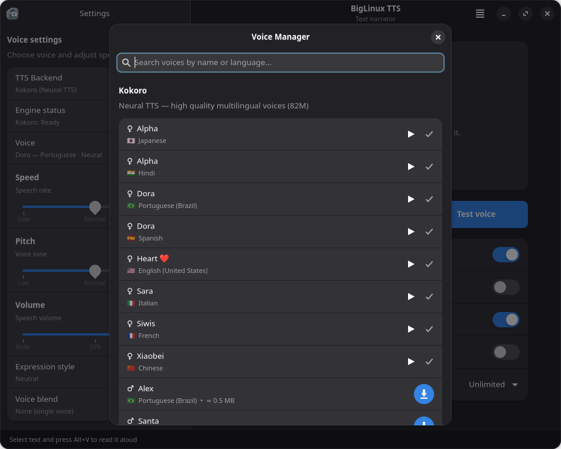 |

| History (main menu → History) | Advanced options |
|---|---|
| 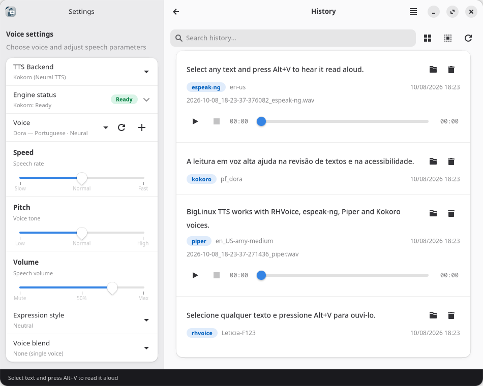 | 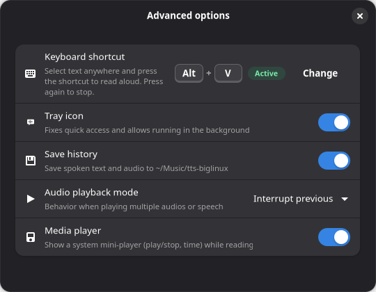 |

| Narrow window (360–600 px) | First run | Brazilian Portuguese |
|---|---|---|
| 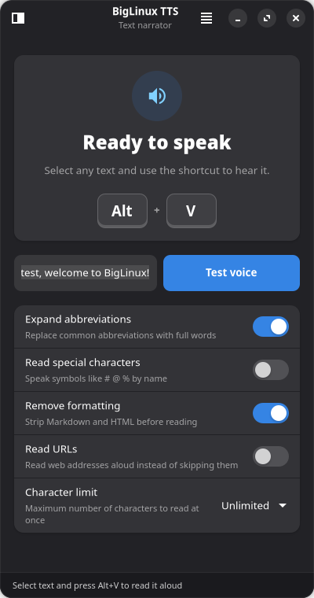 | 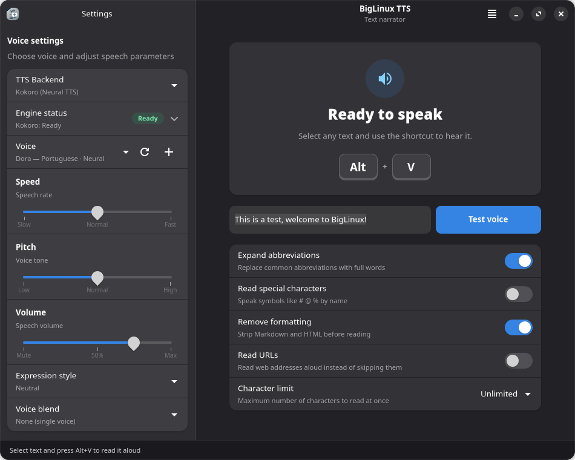 | 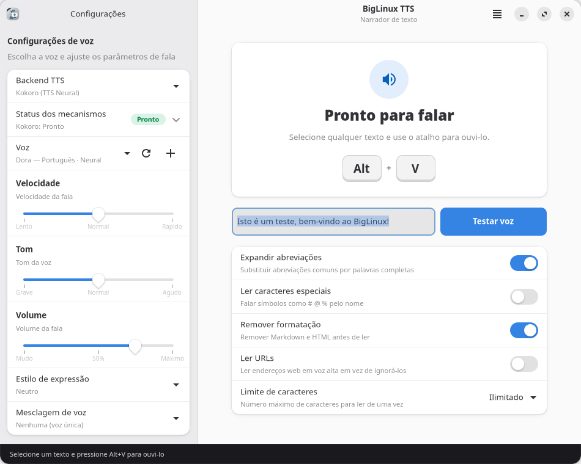 |

<sub>Screenshots of the real application, version 4.1.0 (BigLinux icon theme, rendered headless in a clean profile; sample history entries).</sub>

---

## History

BigLinux TTS was born from a practical need: making text-to-speech accessible and easy on the Linux desktop.

| Date | Version | Milestone |
|------|---------|-----------|
| Sep 2021 | — | First commit by Bruno Gonçalves: initial web-based interface |
| Mar 2022 | — | Rafael Ruscher joins: icon design, CSS refinements, translations |
| Aug 2022 | — | PKGBUILD packaging, i18n with 29 locales, CI/CD workflow |
| Dec 2023 | — | Volume/pitch/rate range inputs, UI polish |
| Feb 2026 | 3.0 | **Full rewrite**: web UI → GTK4 + libadwaita + Python. speech-dispatcher integration, Piper Neural TTS, tray icon (PySide6 subprocess), text processor with abbreviation expansion |
| Mar 2026 | 3.1 | Native RHVoice backend, parallel voice discovery, Python DBus launcher |
| Mar 2026 | 3.2 | Voice Manager dialog with install/remove, theme support, khotkeys sync |
| Jun 2026 | **4.0** | **Native Rust engine** (PyO3): espeak-ng FFI, Piper ONNX inference via `ort` with model caching (7× faster short text). Kokoro Neural TTS integration. Complete i18n audit. Full codebase cleanup |
| Sep 2026 | 4.0 | History in SQLite with retention, Piper streaming, systray playback controls (pause/resume), MPRIS mini-player, pt-BR number/date normalization, diagnostics |
| Oct 2026 | 4.0 | Kokoro fixed for the global shortcut, silent startup, real loading/error states, *Ready to speak* card, engine status, KGlobalAccel shortcut registration with conflict detection, GIL released in Rust, adaptive layout, tray icon breathing on HiDPI, 100 automated tests |
| Oct 2026 | **4.1** | **Release**: history for every engine, long texts streamed by espeak-ng too (bounded memory), text rules follow the voice's language, complete translations in 30 languages, dependencies from the official repositories only, release versioning, CI |

---

## Features

### Text Reading

- **Configurable global hotkey** (default Alt+V) — select text anywhere, press to speak, press again to stop (also while the voice is still loading)
- **"Ready to speak" card** — shows the real state (ready, loading voice, speaking, stopped, error with the reason and a fix such as *Open Voice Manager*) and the shortcut as keyboard keys, with the desktop's confirmation that it is active
- **Engine status** — RHVoice, espeak-ng, Piper and Kokoro each show *Not installed*, *No voices*, *Ready*, and for the selected engine *Loading*, *Speaking* or *Error*
- **System tray icon** — breathes (opacity only) while reading; left-click speaks or stops, right-click offers Pause/Play and Stop while reading, plus Read text, Settings and Quit; the tooltip shows the current shortcut
- **Notifications** — what is being read, and a clear message when something fails or nothing is selected
- **Built-in voice test** — text field to type and hear with the current voice settings
- **Optional history** — every reading that was heard, whatever the engine, is kept and can be replayed (main menu → History, Ctrl+H)
- **Silent start** — opening the app never speaks and never starts speech-dispatcher
- **Long texts** — read to the end with any character limit, including *Unlimited*: espeak-ng and Piper stream sentence chunks, Kokoro reads line by line

### Voice Control

- **Speed** — scale from -100 (slow) to +100 (fast)
- **Pitch** — scale from -100 (low) to +100 (high); for Piper it controls *expressiveness*
- **Volume** — scale from 0 (mute) to 100 (max)
- **Voice selection** — list filtered by engine: "Name — Language · Neural / High quality"
- **Kokoro** — expression presets (neutral, happy, calm, urgent, narrative) and blending with a second voice

### Voice Manager

- Install and remove voices for RHVoice, Piper, espeak-ng (pacman packages via `pkexec`) and Kokoro (downloaded voice files)
- Play/stop a sample with the same button, search by name or language, size shown before installing
- Kokoro downloads: real progress, **Cancel**, verification (incomplete or damaged files are rejected), free-space check, atomic update of `voices.bin`
- Removal asks for confirmation

### Text Processing

The rules follow the **language of the selected voice** (an English voice on a Portuguese desktop gets English rules). Each option applies to every engine.

| Option | What it does | Example |
|--------|--------------|---------|
| Expand abbreviations | Expands slang and titles per language; never inside e-mails, URLs or hyphenated words | `vc` → "você", `Dr. Silva` → "doutor Silva", `w/o` → "without" |
| Normalize numbers (pt) | Numbers, money, percentages, dates and times as words | `R$ 1.234,56`, `08/10/2026`, `21:00` → "vinte e uma horas" |
| Read special characters | Symbols by name (pt, en, es); off: symbols the engines would read are removed | `#` → "cerquilha"/"hash" |
| Remove formatting | HTML tags and Markdown markers; headings keep a pause, numbered lists keep their numbers | `**bold**` → "bold" |
| Read URLs | On: the domain (`https://www.example.com/a?b=1` → "example.com"); off: removed | |
| Character limit | Unlimited, 1K, 5K, 10K, 50K, 100K — cut at a sentence or word boundary | |

### Keyboard Shortcuts

| Shortcut | Action |
|----------|--------|
| Alt+V (default) | Speak/stop selected text (toggle) |
| Ctrl+H | Open History |
| Escape / Alt+Left | Back from History |
| F10 | Open the main menu |
| Ctrl+Q | Quit application |

Changing the shortcut (Advanced options → Keyboard shortcut) registers it with the desktop and only reports success once the desktop confirms it. On KDE Plasma this uses KGlobalAccel over D-Bus: a key already used by another action is reported by name and the previous shortcut is kept. A shortcut needs Ctrl, Alt or Super (or a function key) so normal typing is never captured. GNOME, XFCE and Cinnamon use their own settings.

---

## TTS Engines

### 1. RHVoice

High-quality multilingual TTS — **the default engine**, installed with the package together with the Brazilian Portuguese voice *Letícia*. Played as `RHVoice-test | aplay` (no speech-dispatcher), both for reading and for the Voice Manager preview; the text goes through stdin, so its size is not limited.

| Voice | Language | Quality |
|-------|----------|---------|
| Letícia F123 | pt-BR | ★★★★ |
| Evgeniy | English | ★★★★ |
| + others | Multiple | ★★★–★★★★ |

Settings from versions that used the old speech-dispatcher backend are moved to RHVoice.

### 2. espeak-ng (Native FFI) ⚡

Direct C FFI to `libespeak-ng.so` from the Rust engine — no subprocess for synthesis.

- `AUDIO_OUTPUT_SYNCHRONOUS` mode: espeak-ng renders PCM and never opens the audio device itself (it is also Piper's phonemizer)
- One-time initialization via `OnceLock`, all calls serialized
- Texts longer than 600 characters are streamed in sentence chunks: sound starts at once, memory stays bounded and Stop takes effect between chunks (the command-line fallback reads the text from stdin)
- 100+ languages with basic quality

### 3. Piper (Native ONNX Inference) ★★★★★

Neural TTS with near-human quality. ONNX models run locally through the `ort` crate — the `piper-tts` binary is only a fallback.

**Pipeline**: text → espeak-ng IPA phonemes (FFI) → phoneme IDs → ONNX model → WAV → `aplay`

| Feature | Detail |
|---------|--------|
| Runtime | `ort` 2.0 (system ONNX Runtime, dynamic link) |
| Model cache | load once, reuse; prewarmed in the background after startup |
| Long text | sentence chunks synthesized while the previous one plays |
| Performance | 7× faster than the subprocess for short text |

### 4. Kokoro (Neural TTS) ★★★★★

Neural voices in Portuguese, English, Spanish, French, Italian, Japanese, Hindi and Chinese, with voice blending and expression presets. It runs through the `koko` binary from the `biglinux-kokoro-tts` package (model + base voices).

- One command builder (`kokoro_voice_service.build_koko_command`) serves both reading and the Voice Manager preview: explicit model, voices file, language from the voice prefix, and a private writable work directory (`$XDG_RUNTIME_DIR/biglinux-tts/koko`)
- `koko pipe` streams sentence by sentence (sentences longer than 220 characters are split, punctuation runs collapsed); the card shows *Loading voice* until koko reports that audio started, and a crash of koko is reported as an error
- The selected voice is checked against `voices.bin` before speaking (koko would silently use another voice)
- Voice blending: mix two voices (`voice.W+voice.W`); expression presets adjust the speed
- More voices can be downloaded in the Voice Manager

### Automatic Voice Discovery

All engines are scanned in parallel in a background thread:

1. **RHVoice**: scans `/usr/share/RHVoice/voices/` (speech-dispatcher is not queried: starting it can make other installed modules speak)
2. **espeak-ng**: `espeak-ng --voices` → language code, gender
3. **Piper**: scans `/usr/share/piper-voices/` and `~/.local/share/piper-voices/` for `.onnx` + `.onnx.json`
4. **Kokoro**: `koko voices` on the active `voices.bin` (system base voices + user downloads)

Result: a `VoiceCatalog` with every voice plus, per engine, whether it is installed and has voices (shown as *Engine status*).

---

## Architecture

```
┌──────────────────────────────────────────────────────────────────────────┐
│ main.py — CLI args (--speak, --debug, --version), logging, App.run()      │
├──────────────────────────────────────────────────────────────────────────┤
│ application.py — TTSApplication (Adw.Application, single instance)        │
│   startup → shortcut registration (worker) → tray → MPRIS → prewarm       │
│   --speak: capture selection (worker) → speak / stop (toggle)             │
├────────────────────────┬────────────────────────┬────────────────────────┤
│ UI layer (GTK thread)  │ Service layer          │ Data layer             │
├────────────────────────┼────────────────────────┼────────────────────────┤
│ window.py              │ tts_service.py         │ config.py              │
│  ├ OverlaySplitView    │  ├ speak / stop        │  ├ AppSettings         │
│  ├ header + main menu  │  ├ LOADING/SPEAKING/   │  ├ TTSBackend/TTSState │
│  └ status bar          │  │  ERROR + reasons    │  └ JSON load/save      │
│ main_view.py           │  └ per-engine paths    │ settings_service.py    │
│  ├ Ready to speak card │ shortcut_service.py    │  └ debounced save      │
│  ├ engine status       │  └ KGlobalAccel D-Bus  │ history_db.py          │
│  └ voice settings      │ voice_manager.py       │  └ SQLite + retention  │
│ components.py          │  └ discovery + status  │                        │
│  └ ShortcutKeys, pills │ kokoro_voice_service.py│                        │
│ voice_manager_dialog.py│  └ koko argv, downloads│                        │
│ history_view.py        │ clipboard_service.py   │                        │
│ audio_player.py (Gst)  │ tray_service.py ──────────▶ PySide6 subprocess │
│ welcome_dialog.py      │  tray_icon_frames.py   │   (QSystemTrayIcon)    │
│                        │ mpris_service.py       │                        │
│                        │ desktop_integration_*  │                        │
├────────────────────────┴────────────────────────┴────────────────────────┤
│ tts_engine.so (Rust / PyO3) — GIL released during synthesis               │
│   espeak-ng FFI (synchronous) · Piper ONNX via ort (model cache)          │
├──────────────────────────────────────────────────────────────────────────┤
│ External: RHVoice-test · koko · aplay · wl-paste/xsel · pkexec pacman     │
└──────────────────────────────────────────────────────────────────────────┘
```

### Request Lifecycle (TTS State Machine)

```
              speak()                       audio starts
   IDLE ─────────────────▶ LOADING ─────────────────────▶ SPEAKING
    ▲                        │  (synthesizing,              │
    │                        │   loading the model)         │ playback ends
    │       stop() / Alt+V   │                              │
    ├────────────────────────┴──────────────────────────────┤
    │                                                        │
    │                       engine failed                    │
    │            ┌──────────────── ERROR ◀───────────────────┘
    └────────────┘  (reason + recovery action kept until the next speak/stop)
```

- `LOADING` is real: engines that synthesize first (Piper, Kokoro, espeak-ng) switch to `SPEAKING` when the player starts, or when `koko` reports *Streaming audio*
- `ERROR` carries a translated message and an action (`voice-manager` or `retry`); it is never reset to idle behind the user's back
- A monotonic request generation discards stale audio from an interrupted request
- State listeners always run on the GTK main thread; stale notifications from workers are dropped

---

## Installation

### BigLinux / Manjaro / Arch Linux

On BigLinux the package is in the BigLinux repositories:

```bash
sudo pacman -S tts-biglinux
```

On Manjaro or Arch Linux, build it from the PKGBUILD — every dependency is in the official repositories (`core`, `extra`), no BigLinux or Big Community repository is needed:

```bash
git clone https://github.com/biglinux/tts-biglinux.git
cd tts-biglinux/pkgbuild
makepkg -si
```

This installs the application, the native engine, RHVoice with the Brazilian Portuguese voice *Letícia*, espeak-ng (voices for 100+ languages), the tray icon (PySide6), the History player (GStreamer) and the clipboard tools — everything needed to select text and press Alt+V.

Optional voices:

```bash
# English RHVoice voice (official repositories)
sudo pacman -S rhvoice-voice-evgeniy-eng

# BigLinux repositories only:
sudo pacman -S biglinux-kokoro-tts   # Kokoro neural voices
sudo pacman -S piper-voices-pt-BR    # Brazilian Portuguese Piper voices
```

Piper voices can also be downloaded in the Voice Manager.

### Uninstall

```bash
sudo pacman -R tts-biglinux
```

Personal data stays in your home folder (settings, history, downloaded voices — see [File Locations](#file-locations)); delete those folders to remove it too.

### Run without Installing (Development)

```bash
git clone https://github.com/biglinux/tts-biglinux.git
cd tts-biglinux

# Build the native Rust engine against the SYSTEM onnxruntime
cd tts-engine
ORT_LIB_LOCATION=/usr/lib ORT_PREFER_DYNAMIC_LINK=1 cargo build --release
cd ..

# Link the .so into the application directory
ln -sf ../../../../tts-engine/target/release/libtts_engine.so \
  usr/share/biglinux/tts-biglinux/tts_engine.so

# Run
cd usr/share/biglinux/tts-biglinux
python main.py --debug
```

### Dependencies

#### Required (installed with the package)

All from the official Arch/Manjaro repositories.

| Package | Why |
|---------|-----|
| `python`, `python-gobject` | Python 3 and PyGObject |
| `gtk4`, `libadwaita>=1:1.5` | Interface (AlertDialog, OverlaySplitView, Breakpoint) |
| `python-numpy` | Kokoro voice download conversion (`.pt` → `.npy`) |
| `polkit` | `pkexec` to install/remove voice packages |
| `onnxruntime` | Piper neural inference (system library, dynamic link; provided by `onnxruntime-cpu` and variants) |
| `espeak-ng` | espeak voices and Piper phonemizer (linked by `tts_engine.so`) |
| `alsa-utils`, `alsa-lib` | `aplay` — every engine plays through it; `libasound` for the native engine |
| `sox` | Volume control on the subprocess fallback paths |
| `gstreamer`, `gst-plugins-base`, `gst-plugins-good` | History player (`playbin`, `wavparse`, audio sink) |
| `rhvoice`, `rhvoice-voice-leticia-f123` | Default engine and voice, ready out of the box |
| `speech-dispatcher` | Required by RHVoice's package (the app itself never starts it) |
| `wl-clipboard`, `xsel` | Selected text on Wayland (`wl-paste`; `wl-clipboard-rs` also provides it) and X11 |
| `pyside6`, `qt6-svg` | System tray icon (SVG icons) |

#### Build and check

| Package | Why |
|---------|-----|
| `git`, `rust>=1.85`, `cargo` | Fetch sources, build `tts_engine.so` (also needs `pkgconf` from `base-devel`) |
| `python-pytest` | `check()` runs the test suite |

#### Optional

| Package | Repository | Why |
|---------|------------|-----|
| `rhvoice-voice-evgeniy-eng` | official | RHVoice English voice |
| `xclip` | official | X11 selection capture when `xsel` is missing |
| `biglinux-kokoro-tts` | BigLinux | Kokoro neural voices (`koko`, model, base voices) |
| `piper-voices-pt-BR` | BigLinux | Brazilian Portuguese Piper voices, preinstalled |
| `piper-tts-bin` | BigLinux | Piper command-line fallback (the native engine needs only voices) |
| `rhvoice-brazilian-portuguese-complementary-dict-biglinux` | BigLinux | Extra pronunciation dictionary for RHVoice |

---

## Usage

### GUI

```bash
biglinux-tts            # Open the window (or bring the running one forward)
biglinux-tts --debug    # Detailed logging
biglinux-tts --version  # Print the version
```

### Keyboard Shortcut (CLI)

```bash
biglinux-tts-speak      # What Alt+V runs: biglinux-tts --speak
```

`--speak` is forwarded to the running instance (GApplication) or starts one:

1. Reading or loading a voice → stop (in the default *interrupt* playback mode)
2. Text selected → read it with the configured engine and voice
3. Nothing selected → a short notification says so

### Typical Workflow

1. **First launch**: the welcome dialog explains features and setup
2. **Configure**: choose the engine and voice, adjust speed/pitch/volume
3. **Test**: type text in the test field and press *Test voice* (or Enter)
4. **Daily use**: select text anywhere → Alt+V → listen

---

## Configuration

### File Locations

| Path | Content |
|------|---------|
| `~/.config/biglinux-tts/settings.json` | All app settings (JSON) |
| `~/Music/tts-biglinux/` | Reading history (`history.db`, SQLite) and saved audio, when enabled — a private folder (mode 0700) |
| `~/.local/share/biglinux-tts/kokoro-voices/voices.bin` | Kokoro voices downloaded by the user (system base voices + downloads) |
| `$XDG_RUNTIME_DIR/biglinux-tts/koko/` | Kokoro scratch audio (private, temporary) |
| `~/.local/share/applications/biglinux-tts-speak.desktop` | Launcher bound to the global shortcut |
| `/usr/share/tts-biglinux/locale/*.po` | Installed translations |

### Settings Schema (defaults)

```json
{
  "speech": {
    "rate": -25,
    "pitch": -25,
    "volume": 75,
    "voice_id": "",
    "backend": "rhvoice",
    "kokoro": {
      "voice_blend": "",
      "blend_ratio": 0.5,
      "emotion_preset": "neutral"
    }
  },
  "text": {
    "expand_abbreviations": true,
    "process_urls": false,
    "process_special_chars": true,
    "strip_formatting": true,
    "normalize_numbers": true,
    "max_chars": 0
  },
  "shortcut": {
    "keybinding": "<Alt>v",
    "show_in_launcher": true
  },
  "window": {
    "width": 900,
    "height": 740,
    "maximized": false
  },
  "history": {
    "enabled": false,
    "save_audio": true,
    "save_text": true,
    "playback_mode": "interrupt",
    "max_entries": 1000,
    "max_age_days": 0
  },
  "show_welcome": true,
  "show_media_player": true,
  "config_version": 1
}
```

`playback_mode`: `interrupt` (a new reading replaces the current one; the shortcut toggles), `queue` or `simultaneous` (Stop and Pause reach every reading). `show_in_launcher` turns the tray icon on. The file is written atomically; keys from older versions are ignored and a wrong value falls back to its default without losing the others.

### Legacy Migration

Old-format settings in `~/.config/tts-biglinux/` (individual files: `rate`, `pitch`, `volume`, `voice`) are migrated to the JSON format automatically. Settings that still name the removed speech-dispatcher engine switch to RHVoice.

---

## Internationalization

### i18n System

Translations are gettext `.po` catalogs, read directly by a small parser (`utils/i18n.py`, no `.mo` compilation) — the format BigLinux's translation pipeline produces.

1. **Language**: GNU gettext rules — `LC_ALL` > `LC_MESSAGES` > `LANG` decide the locale; a `C`/`POSIX` locale means English; otherwise `LANGUAGE` (a colon list) wins
2. **Fallback per message**: through the `LANGUAGE` list and from region to language (`pt_BR` → `pt-BR.po` → `pt.po`), then English; catalog names match case-insensitively (`nb`/`nn` use `no.po`)
3. **Search paths**: `<repo>/locale/` (source checkout) → `/usr/share/tts-biglinux/locale/` (installed)
4. **Language and country names** (voice lists) come already translated from the system's `iso-codes`

```python
from utils.i18n import _
label.set_text(_("Ready to speak"))  # → "Pronto para falar" in pt-BR
```

Every user-visible string is a literal inside `_()`, so the CI's plain `xgettext` sees it (a test enforces this). `locale/tts-biglinux.pot` is the template; the CI translates new strings for 27 languages. Portuguese (Brazil) is not in the CI's list: `python3 scripts/sync_translations.py` regenerates the template and brings every catalog in line, keeping existing translations (`--merge pt-BR=file.json` adds new ones, `--check` validates placeholders).

### Available Languages (30)

| Code | Language | Code | Language |
|------|----------|------|----------|
| bg | Bulgarian | ja | Japanese |
| ca | Catalan | ko | Korean |
| cs | Czech | nl | Dutch |
| da | Danish | no | Norwegian |
| de | German | pl | Polish |
| el | Greek | pt | Portuguese (Portugal) |
| en | English | pt-BR | Portuguese (Brazil) |
| es | Spanish | ro | Romanian |
| et | Estonian | ru | Russian |
| fi | Finnish | sk | Slovak |
| fr | French | sv | Swedish |
| he | Hebrew | tr | Turkish |
| hr | Croatian | uk | Ukrainian |
| hu | Hungarian | zh | Chinese |
| is | Icelandic | it | Italian |

### Adding a New Translation

1. Copy the template: `cp locale/tts-biglinux.pot locale/<code>.po` and set `Language:` in the header
2. Translate the `msgstr` entries (keep `{placeholders}`, line breaks and markup unchanged)
3. Validate: `python3 scripts/sync_translations.py --check`
4. The app loads `.po` files directly — no compilation step

---

## Technical Details

### Rust Native Engine (`tts-engine/`)

```
tts-engine/
├── Cargo.toml          # PyO3 0.25, ort 2.0, rodio 0.20, hound, serde, thiserror
├── build.rs            # Link args: pyo3 + libespeak-ng
└── src/
    ├── lib.rs          # PyO3 module: version, speak_espeak, synthesize_espeak,
    │                   #   speak_piper, synthesize_piper, load_piper, stop
    ├── audio.rs        # rodio playback with AtomicBool stop flag
    ├── error.rs        # TtsError enum (thiserror)
    └── backends/
        ├── espeak.rs   # FFI to libespeak-ng (synchronous mode, serialized)
        └── piper.rs    # ONNX pipeline: phonemize → IDs → infer → WAV
```

- Every synthesis and model load runs inside `py.allow_threads`: the GTK main loop keeps running. Measured on a 500-character Piper synthesis: the main loop froze 1788 ms before, 10 ms after
- The application plays the returned WAV with `aplay`, so playback can be paused (SIGSTOP/SIGCONT) and stopped like every other engine
- Build against the system ONNX Runtime: `ORT_LIB_LOCATION=/usr/lib ORT_PREFER_DYNAMIC_LINK=1 cargo build --release --locked` (linking the pip `onnxruntime` breaks the module at runtime)

### Text Processing Pipeline

`text_processor.py` prepares the text before synthesis, with the rules of the voice's language:

1. **Character limit**: cut at a sentence or word boundary
2. **Strip formatting**: HTML tags (only real tags: `x < 5 e y > 3` survives), Markdown bold/italic/code/links/headings/bullets; entities are always decoded
3. **URLs**: the domain, or removed with the space before them
4. **Number normalization** (pt): numbers, money, percentages, dates, times (feminine hours, seconds)
5. **Abbreviations**: one precompiled pattern per language; titles drop their period; with the option off, slang is spelled out so RHVoice does not expand it itself (real words are left alone)
6. **Special characters**: spoken names (pt, en, es), or removal of the symbols engines would read
7. **Cleanup**: spaces collapsed, paragraph breaks kept as pauses

### Selected Text Capture

`clipboard_service.py` detects the display server:

- **Wayland**: `wl-paste --primary --no-newline --type text`, fallback to the regular clipboard
- **X11**: `xsel --primary -o`, fallback to `xsel -o`, then `xclip`
- Only text is requested (an image in the clipboard is skipped) and output is decoded leniently

### Global Shortcut (`shortcut_service.py`)

- One parser/formatter/validator for the GTK accelerator (`<Alt>v` → keys *Alt + V*, Qt key code for KDE)
- **KDE Plasma**: KGlobalAccel D-Bus — `doRegister` + `setForeignShortcut` for `biglinux-tts-speak.desktop/_launch`, then `allShortcutInfos` read-back; `getGlobalShortcutsByKey` finds other actions on the key. Stale components from old versions are cleaned up
- **GNOME / XFCE / Cinnamon**: their keybinding settings, with `biglinux-tts-speak` as the command
- Registration runs in a worker; the card, Advanced options, status bar and tray tooltip update when the desktop answers

### speech-dispatcher Policy

The app never starts or queries speech-dispatcher: starting the daemon runs every installed output module, and some of them speak when started. RHVoice, espeak-ng, Piper and Kokoro are all used directly.

### System Tray IPC Protocol

JSON lines over stdin/stdout between the GTK app and the PySide6 helper:

```
GTK (parent)                         Qt (child)
    │── {"cmd":"set_menu", items} ────▶│  fixed rows, only properties change
    │── {"cmd":"set_tooltip"} ────────▶│  idle tooltip (shows the shortcut)
    │── {"cmd":"set_speaking"} ───────▶│  breathe / dim (paused) / steady (reduced motion)
    │◀── {"event":"ready"} ────────────│
    │◀── {"event":"activate"} ─────────│  left click while idle → read
    │◀── {"event":"player","action":"stop"}  left click while reading
    │◀── {"event":"menu","id":N} ──────│  menu row clicked
    │── {"cmd":"quit"} ───────────────▶│
```

The breathing icon (`tray_icon_frames.py`) changes opacity only: every frame keeps the original pixel size **and** device-pixel ratio, so the icon never shrinks on scaled screens. Frames are cached per opacity level, sizes are limited to 16–48 px per screen scale, and the timer stops when reading ends or pauses. When the desktop asks for reduced motion (`gtk-enable-animations` off) the icon holds a steady level instead of breathing.

### Async and Threading

- **Workers**: clipboard capture, voice discovery, shortcut registration, synthesis, history saving and downloads run in daemon threads; results return through `GLib.idle_add()`
- **Requests**: a generation counter discards stale audio; a request id keeps simultaneous readings apart; a player started after Stop is terminated at once
- **Shutdown**: SIGTERM/SIGINT/SIGHUP quit cleanly, so no player keeps speaking after logout
- **TTS watch**: 300 ms `GLib.timeout_add()` follows the player process and its exit status
- **Settings**: saved 500 ms after the last change
- **No blocking work on the GTK main thread**

---

## Testing

```bash
# Whole suite (GTK widget tests skip automatically without a display)
python -m pytest -q -p no:cacheprovider tests

# Headless GTK
gtk4-broadwayd :5 & GDK_BACKEND=broadway BROADWAY_DISPLAY=:5 python -m pytest -q tests

# Rust engine
cd tts-engine
cargo fmt --all -- --check
ORT_LIB_LOCATION=/usr/lib ORT_PREFER_DYNAMIC_LINK=1 cargo clippy --all-targets --all-features --locked -- -D warnings
ORT_LIB_LOCATION=/usr/lib ORT_PREFER_DYNAMIC_LINK=1 cargo test --release --locked

# Lint, translations, native engine benchmark
ruff check usr/share/biglinux/tts-biglinux tests scripts
python3 scripts/sync_translations.py --check
python3 scripts/benchmark_tts.py
```

222 Python tests and 4 Rust tests cover, among others:

| Area | Tests |
|------|-------|
| Request lifecycle | `test_tts_lifecycle.py` — a fake `koko` process: LOADING → SPEAKING → IDLE, sticky errors, crashes reported, stop while loading, huge texts never block |
| Streaming, history, simultaneous | `test_tts_streaming.py` — every chunk played in order, at most two chunk files, Stop mid-stream, history for RHVoice/espeak-ng/Kokoro, nothing recorded when off or stopped, Stop reaches simultaneous readings |
| Text | `test_text_rules.py`, `test_text_numbers.py`, `test_special_chars.py`, `test_chunking.py`, `test_koko_text.py` |
| Translations | `test_i18n.py` — parser, GNU language precedence, real catalogs, every string extractable by `xgettext`, complete Portuguese catalogs |
| Interface | `test_ui_states.py` — card states, shortcut keys and conflicts, engine status, saved voice kept, sidebar |
| Tray icon | `test_tray_breathing.py` — constant size at 100/125/150/175/200 % scale, smooth bounded breathing, reduced motion |
| Storage and release | `test_history_db.py`, `test_history.py`, `test_config.py`, `test_release.py` (one version and author list everywhere) |
| Native engine | `test_engine_native.py` (skipped without the built engine) |

### Continuous Integration

`.github/workflows/ci.yml` runs on every push and pull request, in an Arch Linux container with the official repositories: Python (ruff, compileall, translations check, pytest), Rust (fmt, clippy `-D warnings`, tests) and the PKGBUILD (namcap, `.SRCINFO`). `translate-and-build-package.yml` updates the translations, discards them if they fail the check, and asks the BigLinux build service for a package.

---

## Building from Source

### PKGBUILD

```bash
cd pkgbuild && makepkg -si
```

The build:

1. `build()` compiles the Rust `tts-engine` with `cargo build --release --locked` against the system ONNX Runtime
2. `check()` runs `cargo test` and the Python test suite (GTK widget tests skip without a display)
3. `package()` copies the `usr/` tree (Python code, icons, desktop files) with its compiled bytecode, installs `libtts_engine.so` as `/usr/lib/tts-biglinux/tts_engine.so` (architecture-dependent) and the `.po` catalogs in `/usr/share/tts-biglinux/locale/`

### Package Versioning

```
epoch=1          # 4.1.0 is newer than the old date versions (26.10.08 > 4.1.0 for vercmp)
pkgver=4.1.0     # = APP_VERSION in config.py = version in tts-engine/Cargo.toml
pkgrel=1
```

`prepare()` refuses to build when the PKGBUILD, the application and the engine disagree on the version; `tests/test_release.py` checks the same in CI.

**Releasing a version**: set the new version in `config.py`, `tts-engine/Cargo.toml` (and `Cargo.lock`), `pkgbuild/PKGBUILD` and the README badge; reset `pkgrel=1` (bump only `pkgrel` to rebuild the same version); merge; tag `vX.Y.Z`.

### Project Structure

```
tts-biglinux/
├── .github/workflows/               # CI checks; translation + package build
├── locale/                          # Translations (.po) and template (.pot)
├── pkgbuild/PKGBUILD                # Arch/BigLinux packaging
├── screenshots/                     # README images
├── scripts/
│   ├── benchmark_tts.py             # Native engine timings (JSON)
│   └── sync_translations.py         # Template + catalogs, like the CI
├── tests/                           # pytest suite
├── tts-engine/                      # Native Rust engine (PyO3)
├── usr/
│   ├── bin/
│   │   ├── biglinux-tts             # Launcher
│   │   └── biglinux-tts-speak       # Global shortcut: biglinux-tts --speak
│   └── share/
│       ├── applications/            # br.com.biglinux.tts.desktop
│       ├── biglinux/tts-biglinux/   # Python application
│       │   ├── main.py              # CLI args, logging, App.run()
│       │   ├── application.py       # Adw.Application lifecycle, shortcut, tray, notifications
│       │   ├── config.py            # Constants, enums, dataclasses
│       │   ├── window.py            # Window, main menu, status bar, adaptive layout
│       │   ├── services/            # TTS, voices, Kokoro, shortcut, clipboard, tray, MPRIS, history
│       │   ├── ui/                  # Main view, Voice Manager, History, welcome, components
│       │   ├── utils/               # i18n, async helpers
│       │   └── resources/           # style.css
│       └── icons/hicolor/scalable/  # SVG icons (app + tray status)
├── LICENSE                          # GPL-3.0-or-later
├── ruff.toml                        # Lint rules (pinned)
└── README.md
```

---

## License

BigLinux TTS is free software, licensed under the [GNU General Public License v3.0 or later](LICENSE).

The engines and libraries it uses keep their own licenses, among them:

| Component | License |
|-----------|---------|
| espeak-ng, RHVoice | GPL-3.0-or-later |
| RHVoice voice Letícia F123 | CC-BY-SA-4.0 |
| Kokoro model (`biglinux-kokoro-tts`) | Apache-2.0 |
| Piper voices (`piper-voices-pt-BR`) | MIT |
| ONNX Runtime | MIT |
| GTK 4, libadwaita, PyGObject, GStreamer | LGPL-2.1-or-later |
| PySide6 / Qt 6 | LGPL-3.0 (or GPL-3.0) |
| Rust crates (PyO3, ort, rodio, serde, …) | MIT or Apache-2.0 |

---

## Authors

- **Rafael Ruscher** <rruscher@gmail.com>
- **Bruno Gonçalves** <bigbruno@gmail.com>
- **Tales A. Mendonça**

---

